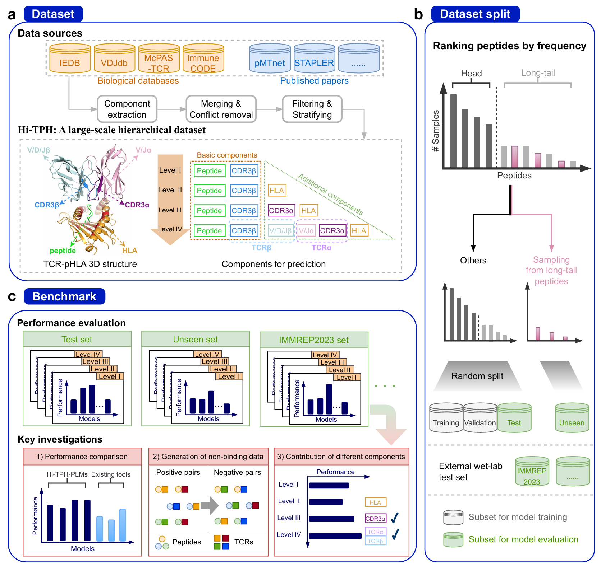

# Machine Learning Dataset and Benchmark for Accurate T Cell Receptor-pHLA Binding Prediction

This repository contains the **Hi-TpH** dataset, a large-scale **Hi**erarchical dataset for **T**CR-**pH**LA binding prediction, and corresponding codes used for data collection and benchmarks.


## Overview of Hi-TpH




## Dependency

Install basic packages using `env.yaml`/`requirements.txt` or the following instructions:

```bash
conda create -n hitph python=3.8
conda activate hitph

# remove '-i https://pypi.tuna.tsinghua.edu.cn/simple/' if necessary
pip install pandas==2.0.3 numpy==1.24.3 scikit-learn tqdm jupyter notebook -i https://pypi.tuna.tsinghua.edu.cn/simple/

conda install pytorch==1.13.0 pytorch-cuda=11.6 -c pytorch -c nvidia
# pip --trusted-host pypi.tuna.tsinghua.edu.cn install torch==1.13.0+cu116 --extra-index-url https://download.pytorch.org/whl/cu116

pip install transformers==4.36.2 datasets==2.16.1 tokenizers==0.15.0 -i https://pypi.tuna.tsinghua.edu.cn/simple/

pip install tape_proteins biopython==1.83 -i https://pypi.tuna.tsinghua.edu.cn/simple/

# for plotting and running notebooks
conda install matplotlib seaborn jupyter notebook
```

An alternative Python 3.10 environment (AMPLIFY needs python>=3.10):
```bash
conda create -n py310 python=3.10
conda activate py310

pip install pandas==2.0 numpy==1.26 scikit-learn tqdm -i https://pypi.tuna.tsinghua.edu.cn/simple/

# AMPLIFY needs python>=3.10, torch==2.2, xformers==0.0.24, ...
# details see: https://github.com/chandar-lab/AMPLIFY/blob/main/pyproject.toml
pip install torch==2.2.0 xformers==0.0.24 --index-url https://download.pytorch.org/whl/cu118 -i https://pypi.tuna.tsinghua.edu.cn/simple/
pip install transformers==4.38 accelerate==0.27 deepspeed==0.13 -i https://pypi.tuna.tsinghua.edu.cn/simple/

pip install tape_proteins biopython==1.83 -i https://pypi.tuna.tsinghua.edu.cn/simple/

# for plotting and running notebooks
conda install matplotlib seaborn jupyter notebook
```


## Data Curation

> [`./data_preprocess`](./data_preprocess/) -> [`./data`](./data/) 

[`./data_preprocess`](./data_preprocess/) folder descripes detailed data collection and processing procedures.

- check [`./data_preprocess/README.md`](./data_preprocess/README.md) for instructions.

[`./data`](./data/) details:

<table style="text-align:center">
<tr>
<th rowspan=2 style="text-align:center"></th>
<th rowspan=2 style="text-align:center">peptide</th>
<th rowspan=2 style="text-align:center">HLA<br></th>
<th colspan=6 style="text-align:center">TCR</th>
<!-- <th rowspan=2 style="text-align:center">#samples</th>
<th rowspan=2 style="text-align:center">source</th> -->
</tr>
<tr>
<th>CDR3a</th>
<th>CDR3b</th>
<th>TRAV/J</th>
<th>TRBV/J</th>
<th>Va.seq</th>
<th>Vb.seq</th>
</tr>
<tr>
<td style="font-weight:bold"> Hi-TpH-level-I.csv </td>
<td> √ </td>
<td></td>
<td></td>
<td> √ </td>
<td></td>
<td></td>
<td></td>
<td></td>
<!-- <td>214,641</td>
<td>[1-4]</td> -->
</tr>
<tr>
<td style="font-weight:bold"> Hi-TpH-level-II.csv </td>
<td> √ </td>
<td> √ </td>
<td></td>
<td> √ </td>
<td></td>
<td></td>
<td></td>
<td></td>
<!-- <td>78,679</td>
<td>[1-3]</td> -->
</tr>
<tr>
<td style="font-weight:bold"> Hi-TpH-level-III.csv </td>
<td> √ </td>
<td> √ </td>
<td> √ </td>
<td> √ </td>
<td></td>
<td></td>
<td></td>
<td></td>
<!-- <td>28,262</td>
<td>[1-3]</td> -->
</tr>
<tr>
<td style="font-weight:bold"> Hi-TpH-level-IV.csv </td>
<td> √ </td>
<td> √ </td>
<td> √ </td>
<td> √ </td>
<td> √ </td>
<td> √ </td>
<td> √ </td>
<td> √ </td>
<!-- <td>26,704</td>
<td>[1-3,5]</td> -->
<tr>
<td colspan=11></td>
</tr>
<tr>
<td style="font-weight:bold"> immrep2023_solutions.csv </td>
<td> √ </td>
<td> √ </td>
<td> √ </td>
<td> √ </td>
<td> √ </td>
<td> √ </td>
<td> √ </td>
<td> √ </td>
<!-- <td>3,484</td>
<td>[6]</td> -->
<tr>
<td colspan=11></td>
</tr>
<tr>
<td colspan=2 style="font-weight:bold"> Hi-TpH-hla_allele2seq.json </td>
<td colspan=9>A dictionary for mapping from HLA allele to HLA amino acid sequences</td>
</tr>
<tr>
<td colspan=2 style="font-weight:bold"> Hi-TpH-tcr_gene2seq.json </td>
<td colspan=9>A dictionary for mapping from TCR gene name to amino acid sequences</td>
</tr>
</table>

<!-- - [1] [IEDB](https://www.iedb.org/)
- [2] [VDJdb](https://github.com/antigenomics/vdjdb-db/releases)
- [3] [McPAS-TCR](http://friedmanlab.weizmann.ac.il/McPAS-TCR/)
- [4] [ImmuneCODE-MIRA](https://clients.adaptivebiotech.com/pub/covid-2020)
- [5] [STAPLER data](https://files.aiforoncology.nl/stapler/data/)
- [6] [IMMREP2023](https://github.com/justin-barton/IMMREP23/blob/main/data/solutions.csv) -->


## Run Benchmarks

> We have temporarily uploaded checkpoints of Hi-TPH-PLMs to [Google Drive](https://drive.google.com/drive/folders/13gv3wWejcQPgogAQr6AwAi5eAdfMWDlP?usp=sharing).

The split level1~level4 benchmark datasets are saved in [`./benchmarks_dataset`](./benchmarks_dataset/) .

<!-- - You can also prepare benchmark datasets from scratch (see `prepare_benchmark_data.ipynb`). -->

Train models using benchmark datasets of different levels (see [`./benchmarks`](./benchmarks/)):

- [Settings] First, change the path in the following file to your own：
  - `bash` files in [`./benchmarks/scripts`](./benchmarks/scripts/): ``**_path``, e.g., ``data_path``.
  - `plm_models.py` in [`./benchmarks`](./benchmarks): ``**_checkpoint``, e.g., ``esm2_8m_checkpoint``.

- [Training] See `./benchmarks/scripts/train_**.sh` to run `train_main.py` for training models.
  - If **finetune** PLMs, you need to **add a line to the script** with the parameter ``--finetune``; if not finetune PLMs, remove it.

- [Evaluation] After Training, you can test the model with `test_main.py`.
  - See `./benchmarks/scripts/eval_**.sh` to run `test_main.py`


